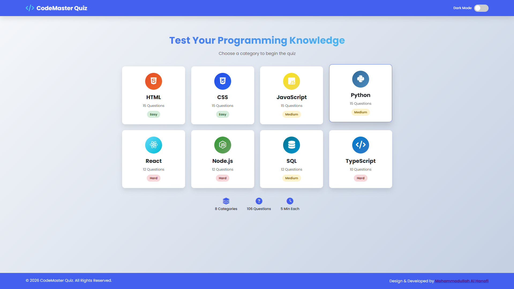

# 💻 CodeMaster Quiz — Test Your Programming Skills

**CodeMaster Quiz** is an interactive, feature-rich programming quiz platform designed to help developers test and enhance their coding knowledge. With **8 categories** and **106 total questions**, users can challenge themselves across various programming languages and frameworks — from HTML basics to advanced React concepts.

## ✨ Features

### 🎯 Core Features
- **8 Programming Categories** — HTML, CSS, JavaScript, Python, React, Node.js, SQL, TypeScript
- **106 Total Questions** — Carefully crafted questions with varying difficulty levels
- **Category Difficulty** — Easy (HTML, CSS), Medium (JavaScript, Python, SQL), Hard (React, Node.js, TypeScript)
- **5-Minute Timer** — Per-quiz countdown with visual pulse animation
- **Real-time Progress Tracking** — Progress bar, question counter, correct/incorrect/remaining stats
- **Score Visualization** — SVG circular progress indicator with percentage
- **Dark/Light Mode** — Toggle switch with persistent state via localStorage
- **Responsive Design** — Mobile, tablet, and desktop optimized

### 🎨 UI/UX
- **Category Cards** — Tech-specific icons and color schemes (HTML5 orange, CSS3 blue, JavaScript yellow, Python blue, React cyan, Node.js green, SQL orange, TypeScript blue)
- **Smooth Animations** — Fade-in, slide-up, scale-in transitions
- **Timer Pulse Effect** — Visual alert when time is running low
- **Progress Bar** — Dynamic fill animation as user progresses
- **Score Circle** — SVG stroke-dashoffset animation showing percentage
- **Reset Functionality** — Return to category selection at any time
- **Exit Button** — Quick return to home screen

### 📊 Quiz Statistics
| Category | Questions | Difficulty | Icon |
|----------|-----------|-----------|------|
| HTML | 15 | Easy | `fa-html5` |
| CSS | 15 | Easy | `fa-css3-alt` |
| JavaScript | 15 | Medium | `fa-js-square` |
| Python | 15 | Medium | `fa-python` |
| React | 12 | Hard | `fa-react` |
| Node.js | 12 | Hard | `fa-node-js` |
| SQL | 12 | Medium | `fa-database` |
| TypeScript | 10 | Hard | `fa-code` |
| **TOTAL** | **106** | — | — |

## 🛠 Technologies Used

- **HTML5** — Semantic structure
- **CSS3** — Custom properties, Flexbox, Grid, Keyframe animations
- **JavaScript (ES6+)** — DOM manipulation, localStorage, SVG animations, timer functions
- **Font Awesome 6** — Category icons and UI elements
- **Google Fonts** — Poppins (clean, modern sans-serif)
- **SVG** — Score visualization circle
